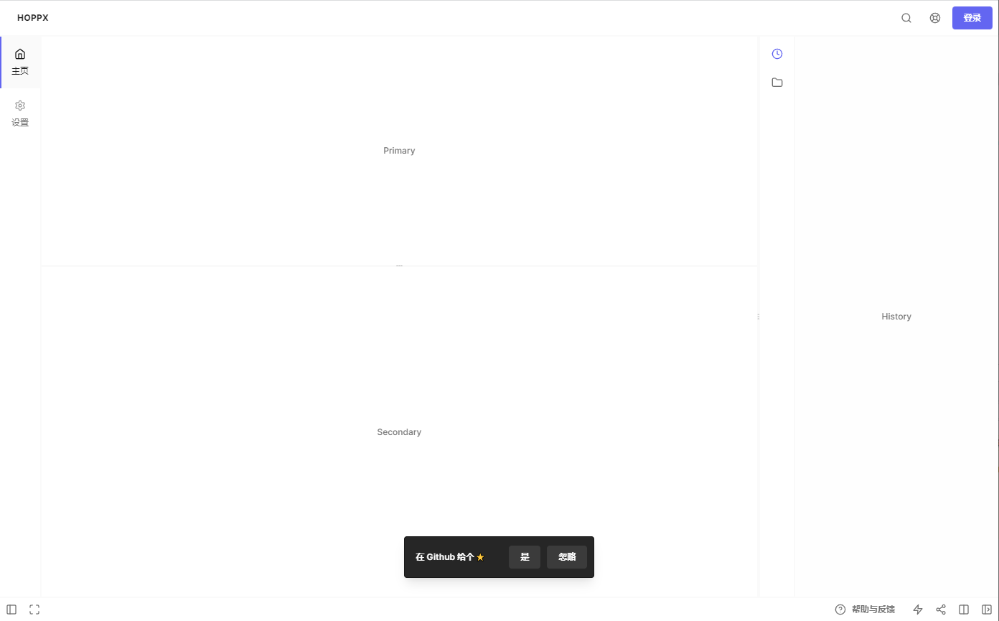

  

  <i>Artwork from <a href="https://hoppscotch.io/">hoppscotch</a></i>

<h1 align="center">Hoppx</h1>

👽 仿 Hoppscotch 风格的网站模板。

<a href="https://hoppx.vercel.app">在线预览</a>

## 🖥️ Preview

## ✨ Do something

移除了 [Hoppscotch](https://github.com/hoppscotch/hoppscotch) 大部分功能代码，只提取了布局，主题与相关组件代码。整理并简化出一个仿 Hoppscotch 风格的网站模板。

- 将状态管理从 [Rxjs](https://rxjs.dev/) 转用 [Pinia](https://pinia.vuejs.org/) 
- 移除 Firebase 服务
- 移除不必要的功能函数、组件、页面，尽可能的简化代码。

## 📝 License

[MIT](./LICENSE)
